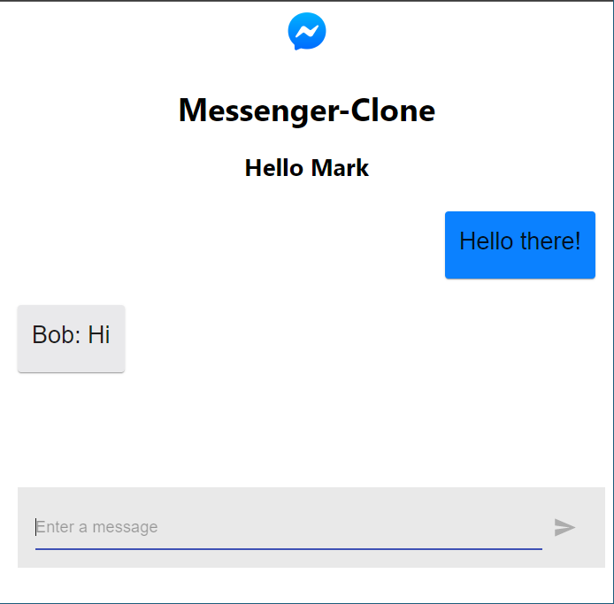

# Messenger-Clone 

An Facebook Messenger clone made using  [ReactJS](https://reactjs.org/) and hosted using [Firebase](https://firebase.google.com/).

Click the [here](https://messenger-clone-react-da08e.web.app/)  to visit the app.

I also used [Material-UI](https://material-ui.com/) for React package for styling the whole app and used [react-flip-move](https://github.com/joshwcomeau/react-flip-move) by Joshua Comeau for animating the message cards.

## Screenshots

